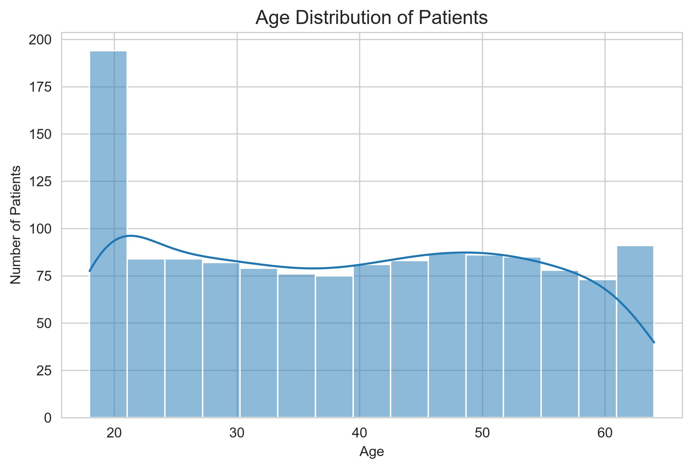
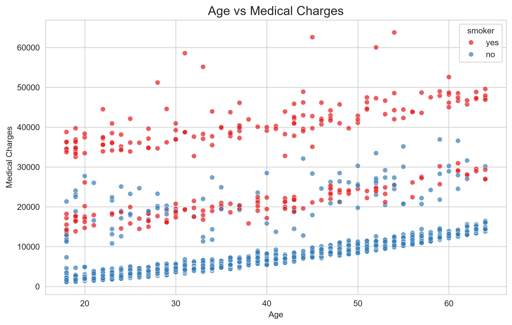
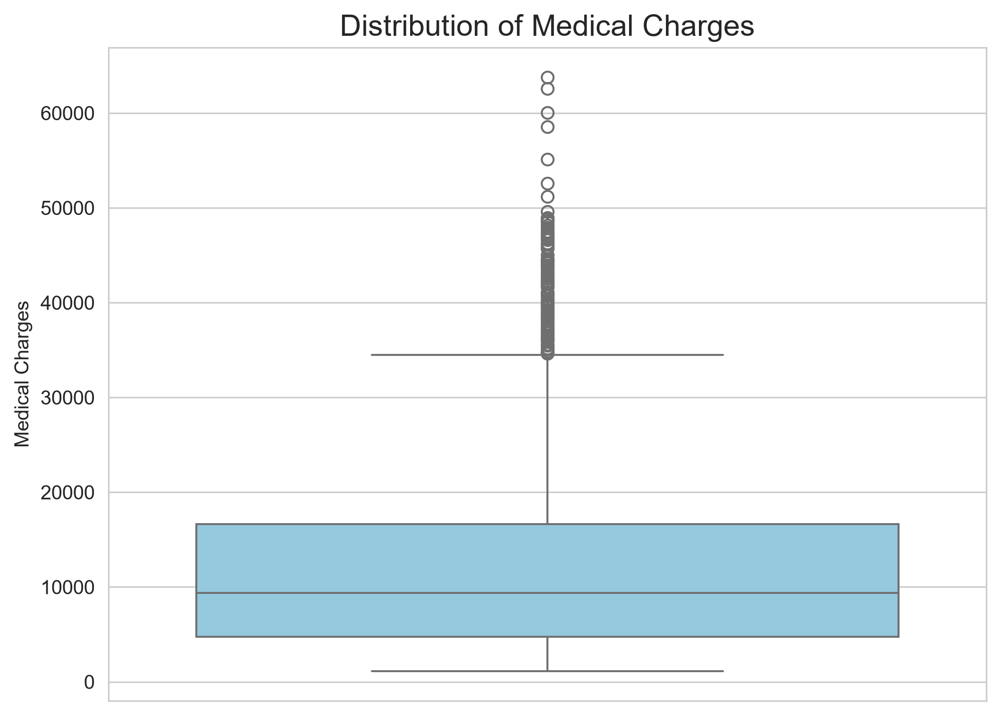
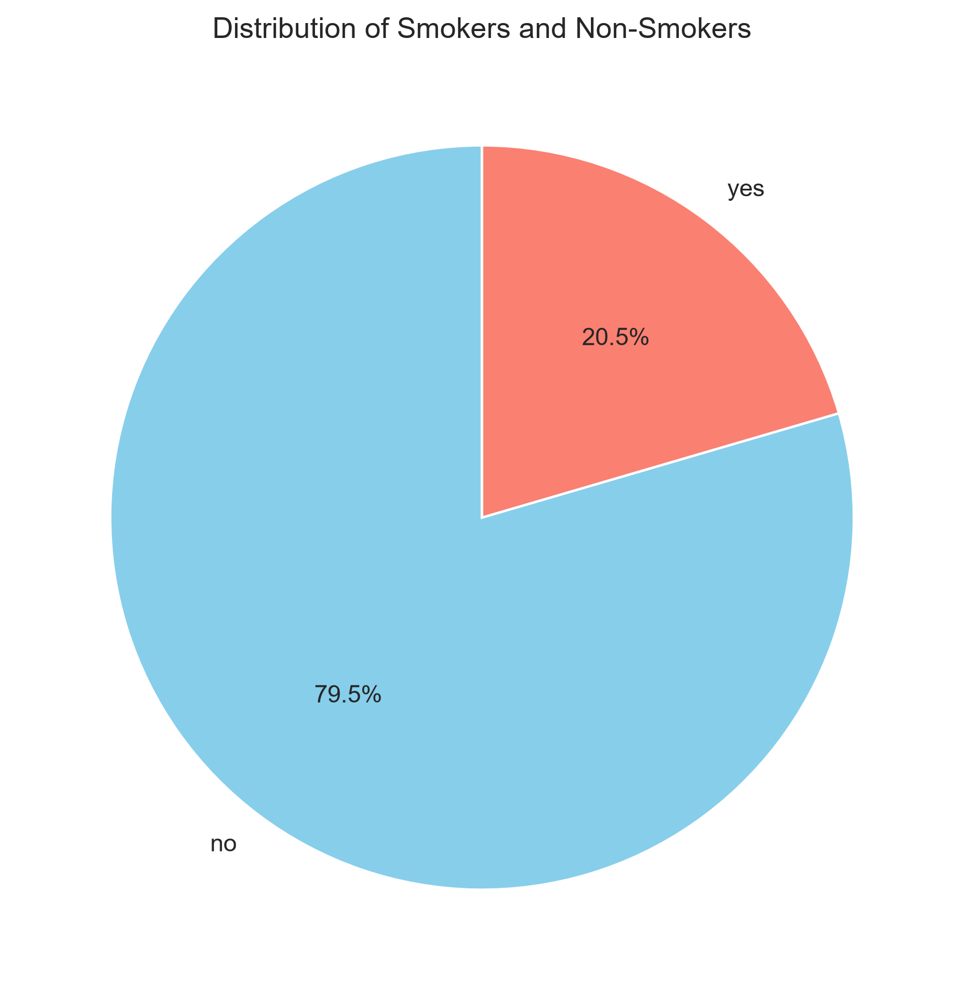
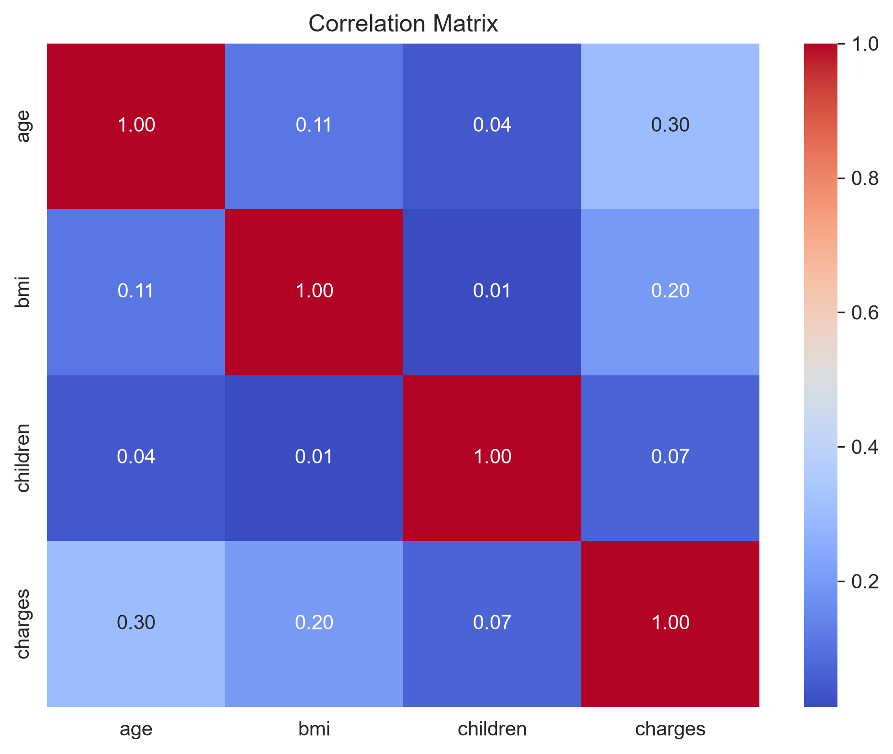
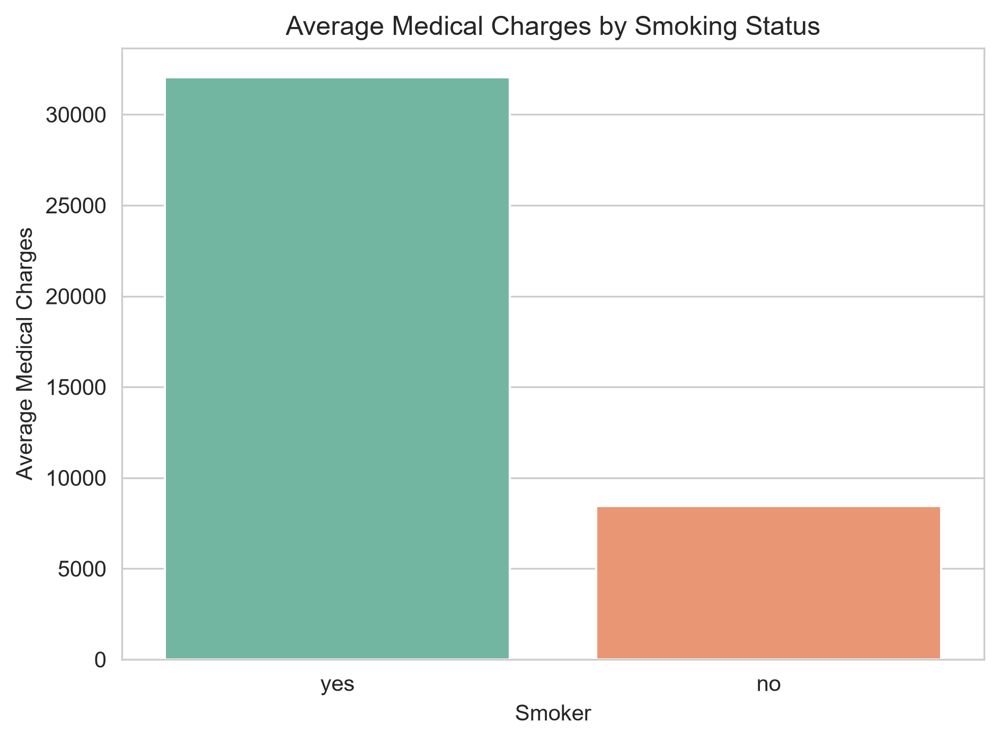

# Medical Cost Analysis System

## Live Demo

🌐 Click here to open the web application:

https://medical-cost-analysis-n9ya8jqvxyfvuk5brynd4l.streamlit.app/

## Project Overview

The Medical Cost Analysis System is a data analysis project developed using Python. The goal of this project is to analyze medical insurance data and identify the key factors that influence medical charges.

Using data visualization and statistical analysis, the project transforms raw healthcare records into meaningful business insights that can support insurance companies in making better decisions.

---

## Technologies Used

- Python
- Pandas
- Matplotlib
- Seaborn
- Jupyter Notebook

---

## Dataset Information

The dataset contains 1,338 medical insurance records.

Features include:

- Age
- Sex
- BMI
- Children
- Smoker Status
- Region
- Medical Charges

---

## Project Workflow

1. Import the dataset
2. Explore the data
3. Clean and inspect the dataset
4. Generate visualizations
5. Analyze business insights
6. Draw conclusions
---

## Project Visualizations

### Age Distribution

---

### Age vs Medical Charges

---

### Distribution of Medical Charges

---

### Smoker Distribution

---

### Correlation Matrix

---

### Average Medical Charges by Smoking Status

---

## Key Insights

- Smoking significantly increases medical charges.
- Age has a positive relationship with insurance costs.
- BMI contributes to higher medical expenses.
- Correlation analysis identifies the strongest factors affecting charges.

---

## Future Improvements

- Streamlit Dashboard
- Machine Learning Prediction
- SQL Database Integration
- Cloud Deployment

---

## Project Structure

Medical-Cost-Analysis/

├── data/

├── notebook/

├── images/

├── presentation/

├── report/

├── README.md

└── requirements.txt

---

## Author

Qusai

Lovely Professional University

Python Data Analytics Internship Project